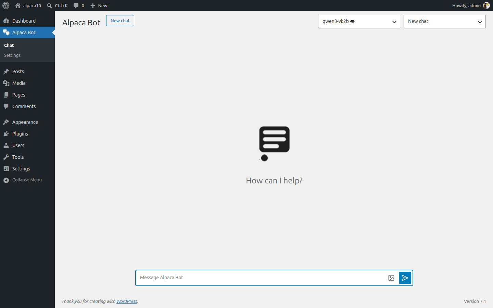
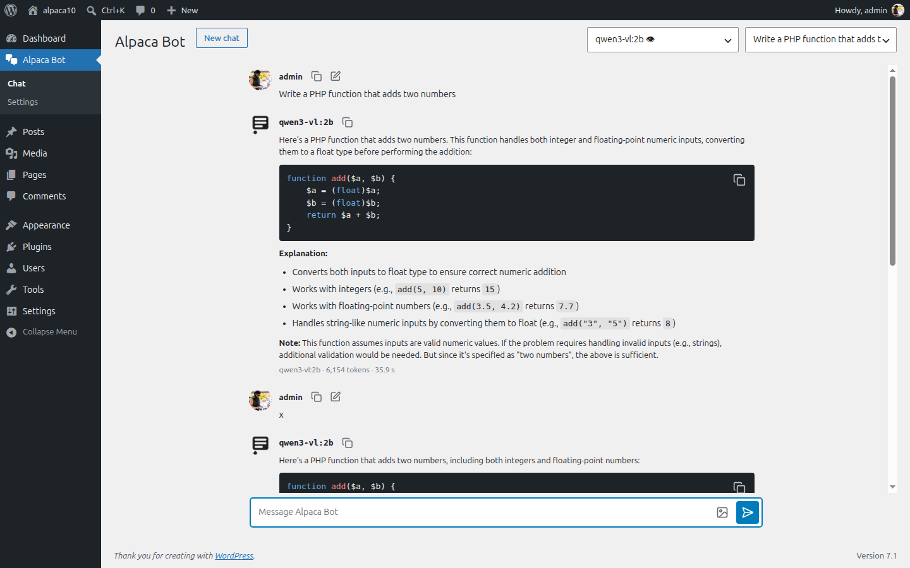

# Alpaca Bot

<div align="center">
  
### A privately hosted WordPress AI Chatbot
  
  

  [](https://discord.gg/vWQTHphkVt)
  
  <a href="https://www.patreon.com/carmelosantana">
  </a>

  **WordPress plugin for quick content creation and workflow automation!**
</div>

---

## 0.5.0 development status

The `develop` branch is a ground-up rewrite of the 0.4 plugin that ships as **0.5.0**, in five phases. 1.0 is reserved for feature complete and fully tested (see `CLAUDE.md`). Everything below
this section describes the 0.5 code on this branch.

- **P1 — foundations, provider, pipeline** (done): settings schema and 0.4 migration, provider
  factory with streaming, usage meter and monthly caps, the chat pipeline and its hooks, and a
  WP-CLI command (`wp alpaca-bot chat|models|usage|settings`).
- **P2 — REST API and settings screen** (done): one namespace, `alpaca-bot/v1` (chat, streaming,
  conversations, models, settings, usage), and the Settings API admin page. Reference, with
  auth, streaming and error examples: [docs/api.md](docs/api.md).
- **P3 — view layer and assets** (done): the admin chat screen, rendered server-side from
  components, with htmx swapping the selects and a small TypeScript bundle driving the streamed
  turn; Lucide icons, a stylesheet on the admin colour variables, and the 0.4 tree deleted.
- **P4 — toolkits, shortcodes, abilities, WordPress AI adapter** (done): the three built-in
  tools, both 0.4 shortcodes back on the new pipeline, three WordPress abilities, and the
  WordPress AI Client as a second provider.
- **P5 — hardening and release** (in progress): CI and Plugin Check, the tag-driven release
  workflow, the security and performance reviews, and this readme.

`readme.txt`'s header block described the shipped 0.4.x release for the whole of development, so
that `Requires PHP: 8.1` next to `Stable tag: 0.4.17` kept 0.4.x updates reaching the PHP 8.1
sites that release was published for. It now describes 0.5.0 -- `Stable tag: 0.5.0`,
`Requires PHP: 8.4`, `Requires at least: 6.9`, `Tested up to: 7.1` -- which is the release
decision, taken on all four rows at once. Its Description, FAQ and Changelog are generated from
this file by `composer docs:readme`; the header block is not, and cannot be.

Spec: [0.5 core refactor](docs/superpowers/specs/2026-09-05-alpaca-bot-1-0-core-refactor.md).
Plans: [P1](docs/superpowers/plans/2026-09-05-alpaca-bot-p1-foundations-provider-pipeline.md),
[P2](docs/superpowers/plans/2026-09-05-alpaca-bot-p2-rest-and-settings.md),
[P3](docs/superpowers/plans/2026-09-05-alpaca-bot-p3-view-layer-and-assets.md),
[P4](docs/superpowers/plans/2026-09-05-alpaca-bot-p4-toolkits-abilities-wp-ai.md),
[P5](docs/superpowers/plans/2026-09-05-alpaca-bot-p5-hardening-and-release.md).

---

- [Description](#description)
- [Screenshots](#screenshots)
- [Requirements](#requirements)
- [Installation](#installation)
- [Setup](#setup)
- [Usage](#usage)
  - [The chat screen](#the-chat-screen)
  - [Settings](#settings)
  - [REST API and WP-CLI](#rest-api-and-wp-cli)
- [Shortcodes](#shortcodes)
- [Frequently Asked Questions](#frequently-asked-questions)
- [Changelog](#changelog)
- [Support](#support)
- [Funding](#funding)
- [Made Possible By](#made-possible-by)
- [License](#license)

---

## Description

**Alpaca Bot** is a chat screen inside WordPress admin, talking to a model you host. Conversations stay on your site, in your own database, and only their author can open them. It runs against [Ollama](https://github.com/ollama/ollama) out of the box, or any OpenAI-compatible endpoint.

### Features

- A chat screen in wp-admin: replies stream in as they are written, with a copy button on every message and code block, "Edit and resend" on your own, and an image attached from the media library for a model that can see.
- Your conversations, stored **privately** on your site (or not at all: the Privacy tab decides) and listed in the screen's history.
- Switch models per conversation; where the site allows it, your pick is remembered as your default.
- A system prompt, per-model overrides (temperature, context window, keep-alive) and a receipt under every reply: model, tokens, time.
- Monthly usage caps, per site and per user, with the meter behind them.
- A REST API under `alpaca-bot/v1` ([docs/api.md](docs/api.md)) and a WP-CLI command.

## Screenshots



> A new conversation: the model and history selects in the header, the composer at the foot.



> A reply with a code block, its copy button, and the receipt under it.

## Requirements

- PHP 8.4+, WordPress 6.9+, an Ollama instance (or any provider php-agents supports)

## Installation

1. Download the latest release from the [releases page](https://github.com/carmelosantana/alpaca-bot/releases).
2. Upload the plugin to your WordPress site.
3. Activate the plugin.

A checkout needs `composer install` (which builds `vendor-prefixed/`) and `pnpm install && pnpm build` (the script, stylesheet and icon sprite under `assets/`, which are not committed).

## Setup

1. Install [Ollama](https://github.com/ollama/ollama) on your localhost or server.
2. In your WordPress admin, open `Alpaca Bot > Settings` and, on the Provider tab, enter the endpoint's base URL. For Ollama it ends in `/v1`: `http://localhost:11434/v1`.
3. Click `Save Changes`. The Models tab then lists what the provider serves; pick a default.

⭐️ **[Become a Patreon](https://www.patreon.com/carmelosantana)** and support [Alpaca Bot](https://carmelosantana.org/alpacabot/) development. ⭐️

## Usage

### The chat screen

Click **Alpaca Bot** in the admin menu, below Dashboard and above Posts. The screen is open to every user who can edit posts (filter `alpaca_bot/admin/menu_capability` to change that).

- The **model** select in the header picks the model for this conversation; where the site allows it, your pick is saved as your default. The **history** select opens one of your earlier conversations, and **New chat** starts a fresh one.
- Type in the box at the foot of the screen. **Enter** sends, **Shift+Enter** adds a line, **Escape** clears the box.
- The image button attaches a picture from the media library to your next message, for a model that can see. The largest image the screen takes is set by the site's PHP `post_max_size`, not its upload limit: the image travels inside the message, not as an upload.
- Replies stream in as they are written. Every message has a **Copy** button, your own have **Edit and resend**, and a code block has its own copy button. Under a reply is its receipt: the model, the tokens it used and how long it took.
- The **Help** tab at the top right of the screen repeats this, and documents the shortcodes.

### Settings

`Alpaca Bot > Settings` (administrators) is one page in six tabs: **Provider** (the endpoint, its key, the timeout), **Models** (the default, temperature, context window, keep-alive, and per-model overrides), **Chat** (system prompt, welcome text, what users may change), **Privacy** (whether conversations and the usage log are stored, and for how long), **Limits** (monthly token caps for the site and per user) and **Tools** (what the model may do besides answer — read the next section before you leave those as they come). Every field is also readable and writable over the REST API (`GET`/`PUT /settings`).

### Tools, and what they let the model reach

`Settings > Tools` switches the model's tools on and off. Three ship, **all three on by default**: `web_fetch` reads one public web page as text, `summarize` condenses text through the model, and `draft_post` writes a draft. Read this section before you leave `web_fetch` on, and before you open the chat to a role.

**`web_fetch` makes the web server send a request, and hands the reply back.** Every URL is checked twice before the fetch — WordPress's own `wp_http_validate_url()`, then the plugin's own check over every address the name resolves to, on the first URL and on every redirect — and http(s) only, ports 80/443/8080 only, no private, loopback, link-local or other special-purpose address. What no check of that shape can cover is a name whose answer *changes* between the check and the connection: each is a separate DNS lookup, so a host under someone else's control, with a short TTL, can answer the checks with a public address and the connection with `127.0.0.1` or a cloud metadata address. The response body then comes back as text. Closing that means pinning the resolved address into the transport, which is a compatibility project and is planned for a later 0.x release.

Who can reach it, today, with no model involved: **anyone who can edit posts** — a Contributor included, since core grants Contributors `edit_posts` — can put `[alpacabot_agent name="get" url="…"]` in their own draft and preview it. So treat `web_fetch` as a capability you are granting your authors, not as something only the model uses.

**An egress policy is the supported mitigation**, and it is the one that holds for every plugin on the site at once: stop the web server's host from opening outbound connections to your private ranges and to `169.254.169.254`, at the network or the host firewall. On a cloud instance, require IMDSv2. If you cannot do that and do not need the tool, leave `web_fetch` off — the chat, the drafts and the summaries all work without it.

**Opening a route to a role opens the tools to that role too.** `alpaca_bot/capability/chat` (and `chat/stream`) can name any capability, `read` and `exist` included, and that is deliberate — it is how a site builds a subscriber-facing or public chat. But the toolkits a turn may call are chosen by the `toolkits.enabled` setting alone: there is no second capability check between a role that may chat and the tools that are switched on. So a role you admit only to converse gets `web_fetch` with it. Only `draft_post` checks a capability of its own (`edit_posts`/`edit_pages`) and refuses a role that lacks it. Until a later 0.x release adds a floor of its own, use the `alpaca_bot/toolkits` filter to take `web_fetch` away from the users you are opening the chat to:

```php
add_filter( 'alpaca_bot/toolkits', function ( array $toolkits, int $user_id ): array {
    if ( ! user_can( $user_id, 'edit_posts' ) ) {
        unset( $toolkits['web_fetch'] );
    }
    return $toolkits;
}, 10, 2 );
```

### REST API and WP-CLI

Everything the screen does is a route under `alpaca-bot/v1`: a turn (`POST /chat`, then its stream as server-sent events), conversations, models, settings and usage. [docs/api.md](docs/api.md) is the reference, with authentication, streaming and error examples. From the command line, `wp alpaca-bot chat|models|usage|settings` does the same.

## Shortcodes

Both 0.4 shortcodes are back on the new pipeline. Both are for logged-in users who can edit posts (`edit_posts`); anyone else sees a notice.

### `[alpacabot prompt="…"]`

Puts the model's answer to the prompt in a post or page.

| Attribute | Default | What it does |
| --- | --- | --- |
| `prompt` | | The message sent to the model. Without it, the shortcode is the chat screen (below). |
| `model` | the viewing editor's model | The model, where the site lets users change it (Settings › Chat); it must be one the provider lists. Without it, the answer runs on the model the editor who first views the page would chat on (their own preference where the site lets users change it, else the site's default), and the cache does not record which. |
| `system` | the site's system prompt | The system prompt for this answer. |
| `temperature` | the model's setting | The temperature for this answer, 0 to 2. |
| `format` | `markdown` | `markdown` renders the answer (raw HTML stripped, links kept); `text` shows it as plain, escaped text. |
| `cache` | `1h` | How long the answer is kept: a number with a unit (`45s`, `30m`, `1h`, `2d`), a year at most. `off` generates on every view. Anything else keeps the default. |

**Generating an answer costs provider tokens** and counts against the monthly cap of the user viewing the page, so it is cached (a transient, per shortcode, per post and per `cache` duration) and served from the cache until it expires. Two identical shortcodes on two pages are two answers; changing the site's system prompt starts a new answer, changing its default model does not (the model is part of the answer's identity only when the shortcode names one). When a turn fails, the page shows why in the words the chat uses (the cap, a model the provider does not list, or a fixed "could not complete" message: the provider's own error, which quotes its endpoint, goes to the debug log under `WP_DEBUG`), and nothing is cached.

**The block editor and the REST API never generate.** `content.rendered` carries the cached answer, or a notice when there is none; an answer is generated only when the page is viewed on the site. So a client listing a hundred posts over the API spends nothing, and the editor's preview shows what the cache holds.

**A generation counts against the same per-minute limit as the chat.** Thirty a minute per user, shared with the chat screen, the REST routes and the abilities, and moved everywhere at once by the `alpaca_bot/rate_limit` filter (bucket `chat`). A cached answer costs nothing; a page carrying more shortcodes than the minute allows shows the rest as a "Too many requests" notice, caches nothing for them, and fills them in on a view after the minute turns over.

**Anyone who can write a post can write a prompt.** A Contributor can put a prompt, and a `system` prompt, in a draft; once it is published, the first user with `edit_posts` to view the page generates the answer, the tokens count against that viewer's cap, and the answer is on the page for everyone without anyone having read it first. The markdown is sanitised (no scripts, no raw HTML), but links and images the model writes reach the public page. Review a page after its answer appears. A per-site capability setting for this belongs to the admin-wide panel of a later 0.x release.

**A visitor never triggers a generation.** A visitor, or a logged-in user who cannot edit posts, sees a notice in place of the answer. A site that wants visitors to see the answer returns `true` from the `alpaca_bot/shortcode/allow_guests` filter (`(bool $allow, int $postId, string $tag)`); they then see the cached answer and nothing else. When the cache has expired, visitors see the notice again until someone who can edit posts opens the page. That is the point: a page nobody with the capability opens spends nothing, whatever the model costs.

```php
add_filter('alpaca_bot/shortcode/allow_guests', '__return_true');
```

### `[alpacabot]`

With no `prompt`, the chat screen on a page, for logged-in users who can edit posts, with the same bundle and stylesheet as in wp-admin (a front-end design of its own is a later 0.x release). A visitor sees a login notice and loads nothing. The REST API and the block editor show a notice in its place, as for a prompt. The screen's markup carries the viewing user's REST nonce, as it does in wp-admin; it is useless without their cookies, but a full-page cache set to cache pages for logged-in users would store one editor's page and serve it to another, so leave a page carrying the shell out of such a cache.

### `[alpacabot_agent name="get|summarize" url="…" length="…"]` (deprecated)

The 0.4 form still works, under the same rules and cache: `get` shows the page's readable text, `summarize` fetches it and asks the model for a summary (`length` is free text, "2 sentences"; `model` and `cache` as above). The fetch is the chat's `web_fetch` tool itself, so it runs only while that tool is on under Settings › Tools, and through the same address guard: a private, local or non-http(s) address is refused. It logs a deprecation notice once per request under `WP_DEBUG` and goes away in a later 0.x release. Put the text to summarize in a `prompt` instead, or open the URL in the chat, where the fetch and summarize tools read it for you: `[alpacabot prompt="Summarize https://…"]` would **not** work, since a shortcode's turn runs no tools and the model cannot open the URL.

## Frequently Asked Questions

### Do I need my own AI server?

Yes. Alpaca Bot does not ship a model and sends nothing to a service of ours. Point it at an [Ollama](https://github.com/ollama/ollama) instance, or at any OpenAI-compatible endpoint, on the Provider tab. On WordPress 7.0 and later there is a second option: **WordPress AI provider** routes every turn through the AI client built into core, to whichever AI provider plugin the site has configured under Settings › Connectors. That path does not stream, because the WordPress client does not.

### What leaves my site?

Whatever you type, and the recent messages of the conversation, go to the endpoint you configured, and nothing else. Conversations and usage receipts are rows in your own database. Turn conversation storage off entirely on the Privacy tab; a receipt is still written for every reply, because that is what the monthly caps count, and it never holds message text.

### Who can use it?

The chat screen is open to anyone who can edit posts, which includes Contributors. The `alpaca_bot/admin/menu_capability` filter changes that. Settings is administrators only. Read **Tools, and what they let the model reach**, under Usage, before you open the chat to a role: a role admitted to chat gets the enabled tools with it.

### How do I stop it running up a bill?

Three brakes, and they are independent. **Limits** sets a monthly token cap for the whole site and another per user, counted from the receipts and enforced on the server. A shared per-minute rate limit (thirty requests a user, moved by the `alpaca_bot/rate_limit` filter) covers the chat screen, the REST routes, the abilities and the shortcodes together. And **Tools** decides what the model may do besides answer. Shortcode answers are cached, and never generated for a visitor or for the REST API.

### I upgraded from 0.4. Where did my settings go?

Into one option, moved automatically on the first request after the upgrade. Two things do not survive the move: 0.4's API username and password were sent as HTTP Basic and 0.5 sends a Bearer token instead, so the Provider tab starts with an empty **API key** for you to fill in. Your 0.4 conversations are kept, and become private to their author, which is what 0.5 enforces everywhere.

### The model answers with the text of a tool call instead of an answer.

Some small models advertise tool support and then write the call out as prose. On the **Models** tab, set that model's **Tools** override to off; it beats whatever the provider claims. A model too small to use tools well is usually too small for the tools to be worth it.

## Changelog

Releases before 0.5.0 are on the [releases page](https://github.com/carmelosantana/alpaca-bot/releases).

### 0.5.0

A ground-up rewrite. The 0.4 code is gone rather than refactored, so the list below is what an upgrading site notices, not a summary of every commit.

**Breaking**

- **PHP 8.4 and WordPress 6.9 are required.** The 0.4 listing asks for PHP 8.1 and WordPress 6.4. On PHP below 8.4 the plugin file loads nothing but an admin notice saying so.
- **The 0.4 classes are gone.** `AlpacaBot\Agents`, `AlpacaBot\Api\*`, `AlpacaBot\Define`, `AlpacaBot\Help`, `AlpacaBot\Log\Post` and `AlpacaBot\Utils\*` were deleted, and with them the `alpaca_bot_*` hooks they applied. What 0.5 fires is in [docs/hooks.md](docs/hooks.md), generated from the call sites.
- **The REST routes changed.** The namespace is still `alpaca-bot/v1`, but 0.4's `htmx/*` and `wp/*` fragment endpoints are gone. 0.5 serves `/chat`, `/chat/{id}/stream`, `/conversations`, `/conversations/{id}`, `/models`, `/settings`, `/settings/schema`, `/usage` and a `/view/*` group; [docs/api.md](docs/api.md) is the reference.
- **Settings moved into a single option** and are migrated automatically on the first request after the upgrade. 0.4's API username and password are not carried over — they went out as HTTP Basic, and 0.5's key goes out as a Bearer token, so an empty field you must fill is better than a populated one that cannot authenticate. 0.4's "Limit chat history" becomes **Messages sent to the model**.
- **Existing conversations become private.** 0.4 stored them as published posts; the migration flips each to private and gives it an author, because 0.5 lets only a conversation's own author open it. A large history is moved a hundred rows per request rather than in one.
- **`[alpacabot]` no longer reads the shortcode's content as the prompt.** 0.4 sent the text between the tags; 0.5 reads a `prompt` attribute, and with no `prompt` it renders the chat screen on the page. An enclosing `[alpacabot]…[/alpacabot]` left over from 0.4 therefore renders a chat screen, not an answer.
- **A shortcode never generates for a visitor.** Generating costs tokens, so it needs a logged-in viewer who can edit posts. Anyone else sees a notice, or the answer an editor already cached where the site returns true from the `alpaca_bot/shortcode/allow_guests` filter. The REST API and the block editor never generate either, whoever is asking.
- **The shortcode `cache` attribute changed, and so did its default.** This is the one that costs money. In 0.4 a bare `[alpacabot]` cached its answer permanently — in the post's meta inside the loop, in an option outside it — so a page generated once and never again. In 0.5 the default is a one-hour transient: the same page regenerates every hour, at the provider's price, the next time a viewer who may generate opens it. Write `cache="365d"` for the old behaviour, which is the longest 0.5 accepts. The spellings changed with it: 0.4 read `postmeta`, `option`, a number of seconds, and `0`, `disable` or `false` to switch caching off, while 0.5 caches in a transient only, for a duration written as `45s`, `30m`, `1h` or `2d`. `off` is now the only word that disables it, and 0.4's five other spellings — `postmeta`, `option`, `0`, `disable` and `false` — all fall through to that one-hour default.
- **`[alpacabot_agent]` is deprecated.** It still fetches its URL and still asks the model for a `summarize`, but it logs a deprecation notice and goes away in a later 0.x release. Its fetch is now the `web_fetch` tool, so it does nothing while that tool is off under Settings › Tools, and it refuses a private, local or non-http(s) address.

**Added**

- A rewritten chat screen in wp-admin. Replies stream in over server-sent events as the model writes them, with a copy button on every message and code block, "Edit and resend" on your own, a thinking model's reasoning in a fold of its own, and an image attached from the media library for a model that can see.
- A receipt under every reply: the model, the tokens it spent, how long it took, and how many tools it ran.
- Conversations stored as private posts owned by their author, listed in the screen's history, with the transcript sent to the model bounded by a setting.
- A usage meter with monthly token caps for the site and per user, enforced on the server, and a daily cleanup that keeps receipts for as long as the Privacy tab says.
- A Settings API page in six tabs — Provider, Models, Chat, Privacy, Limits, Tools — with per-model overrides for temperature, context window, keep-alive, system prompt and tool support.
- Tools the model can call: `web_fetch` reads one public web page as text under a two-stage address guard, `summarize` condenses text through the model, and `draft_post` writes a draft it never publishes. All three are on by default and switchable per site.
- Three WordPress abilities — `alpaca-bot/chat`, `alpaca-bot/summarize` and `alpaca-bot/draft-post` — so other plugins and the MCP adapter can call the same code the screen does.
- A REST API under `alpaca-bot/v1` covering everything the screen does, and `wp alpaca-bot chat|models|usage|settings` on the command line.
- A per-minute rate limit shared by the chat screen, the REST routes, the abilities and the shortcodes, under one `alpaca_bot/rate_limit` filter.
- Both 0.4 shortcodes, back on the new pipeline: `[alpacabot]` for an answer in a page or the chat screen on it, and the `[alpacabot_agent]` shim above.
- The plugin's own dependencies are namespace-prefixed, so php-agents or CommonMark installed by another plugin cannot collide with the copies shipped here.

## Support

If you need help or have questions, please join our [Discord](https://discord.gg/vWQTHphkVt) community.

Premium support and video calls are available to our [Patreon](https://www.patreon.com/carmelosantana) subscribers. We can help set up your [Ollama](https://github.com/ollama/ollama) instance, troubleshoot issues, and more.

Patreon's also receive;

- Access to our hosted [Ollama](https:/github.com/ollama/ollama) instances.
- Priority feature requests.
- Early access to new features and releases.
- Video and community support.

Please consider [becoming a Patreon](https://www.patreon.com/carmelosantana) today!

## Funding

If you find this project useful or use it in a commercial environment please consider donating today with one of the following options.

- Bitcoin `bc1qhxu9yf9g5jkazy6h4ux6c2apakfr90g2rkwu45`
- Ethereum `0x9f5D6dd018758891668BF2AC547D38515140460f`
- Patreon [`patreon.com/carmelosantana`](https://www.patreon.com/carmelosantana)

## Made Possible By

- Emma Delaney's [How to Create Your Own ChatGPT in HTML CSS and JavaScript](https://emma-delaney.medium.com/how-to-create-your-own-chatgpt-in-html-css-and-javascript-78e32b70b4be)
- [Lucide](https://lucide.dev) Beautiful & consistent icons - ISC license
- [htmx](https://htmx.org/) High power tools for HTML - 0BSD license
- [league/commonmark](https://commonmark.thephpleague.com/) Markdown parser for PHP - BSD-3-Clause license
- [php-agents](https://github.com/carmelosantana/php-agents) Provider-agnostic AI agents for PHP - MIT license
- [Ollama](https://github.com/ollama/ollama) Get up and running with large language models locally - MIT license

## License

- [GNU General Public License version 2](http://www.gnu.org/licenses/gpl-2.0.html) or later
