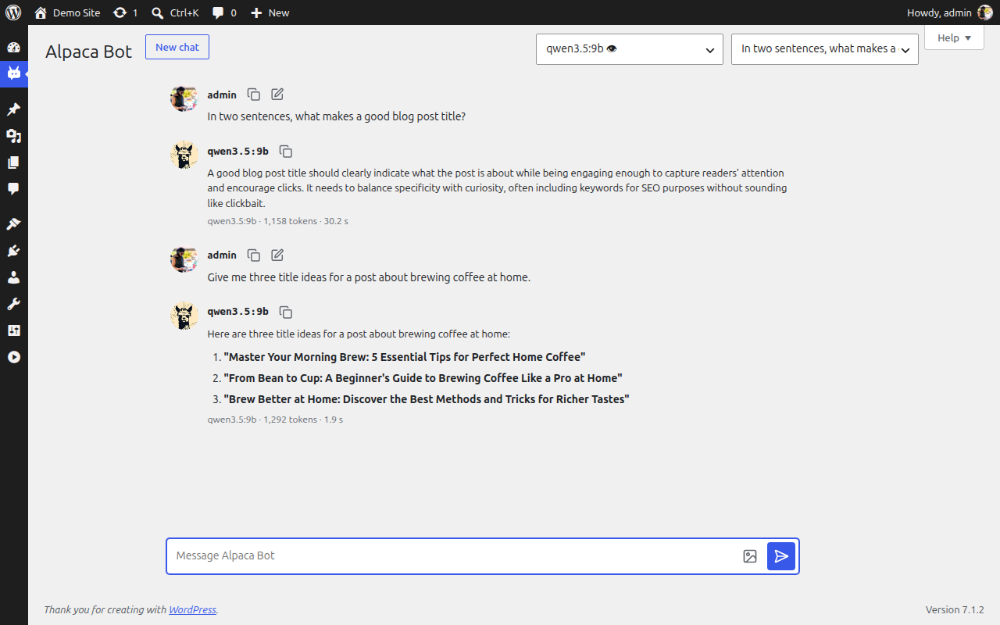
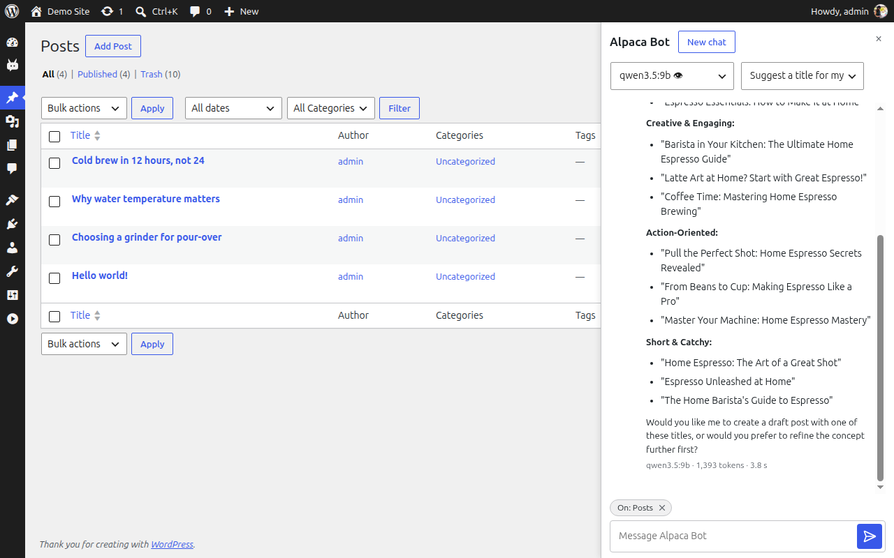
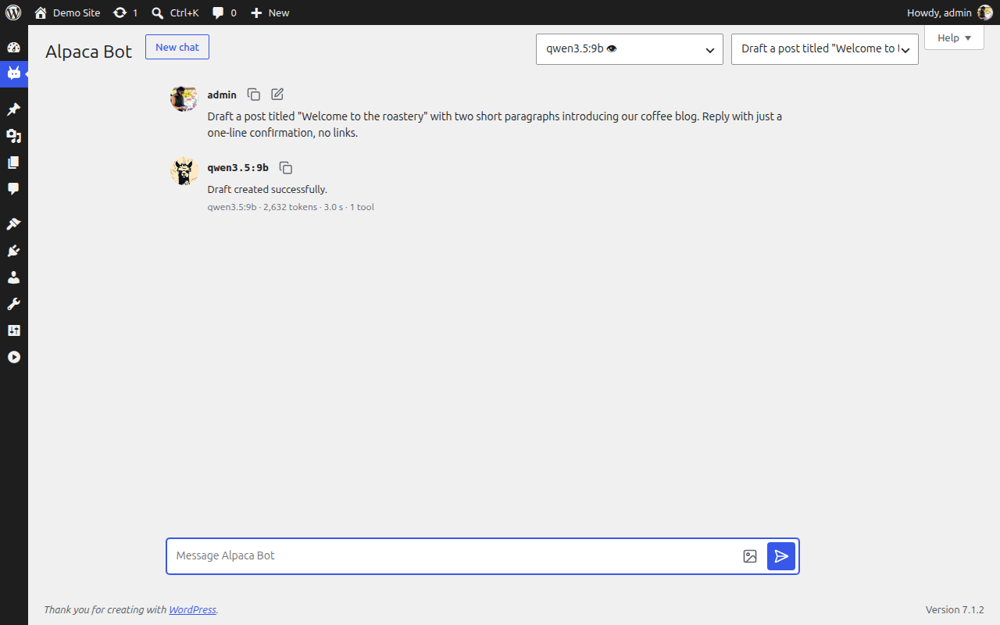
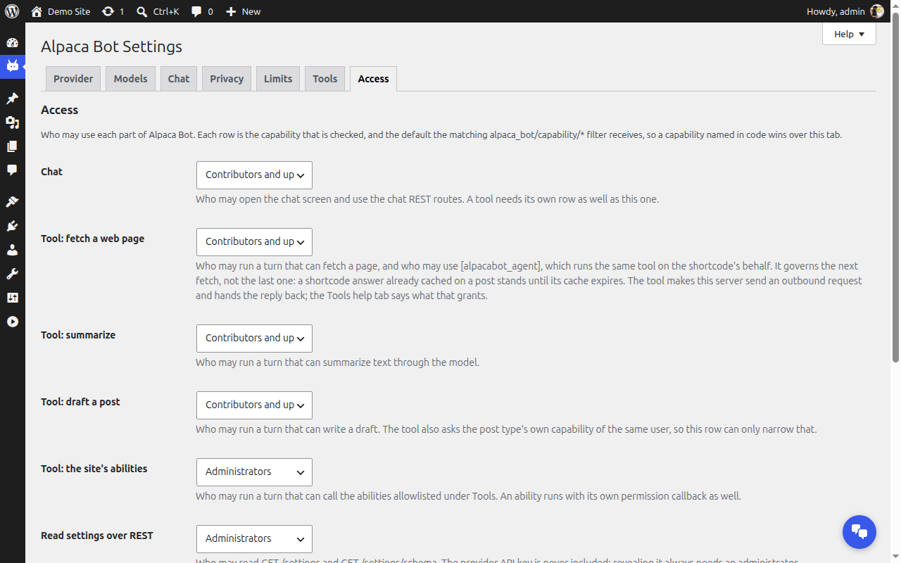

# Alpaca Bot

<div align="center">
  
### A privately hosted WordPress AI Chatbot
  
  

  
  <a href="https://www.patreon.com/carmelosantana">
  </a>

  **WordPress plugin for quick content creation and workflow automation!**
</div>

---

- [Description](#description)
- [Screenshots](#screenshots)
- [Requirements](#requirements)
- [Installation](#installation)
- [Setup](#setup)
- [Usage](#usage)
  - [The chat screen](#the-chat-screen)
  - [Settings](#settings)
  - [REST API and WP-CLI](#rest-api-and-wp-cli)
- [Shortcodes](#shortcodes)
- [Frequently Asked Questions](#frequently-asked-questions)
- [Changelog](#changelog)
- [Support](#support)
- [Funding](#funding)
- [Made Possible By](#made-possible-by)
- [License](#license)

---

## Description

**Alpaca Bot** is a chat screen inside WordPress admin, talking to a model you host. Conversations stay on your site, in your own database, and only their author can open them. It runs against [Ollama](https://github.com/ollama/ollama) out of the box, or any OpenAI-compatible endpoint.

### Features

- A chat screen in wp-admin: replies stream in as they are written, with a copy button on every message and code block, "Edit and resend" on your own, and an image attached from the media library for a model that can see.
- The same chat as a drawer on most other admin screens and as a sidebar in the block editor. The drawer carries the screen it is on, and both carry the post being edited, as chips above the composer; a chip you take off is not sent.
- Your conversations, stored **privately** on your site (or not at all: the Privacy tab decides) and listed in the screen's history.
- Switch models per conversation; where the site allows it, your pick is remembered as your default.
- A system prompt, per-model overrides (temperature, context window, keep-alive) and a receipt under every reply: model, tokens, time.
- Monthly usage caps, per site and per user, with the meter behind them.
- Tools the model can call, each switchable: fetch a web page, summarize, write a draft, and the abilities tool, which offers the WordPress abilities an administrator ticks and runs each as the chatting user.
- Remote MCP servers under Settings › Tools: **Discover tools** lists a server's tools, and the model is offered the ones you approve; **Tools, and what they let the model reach** says what that means.
- **Settings › Access**: who may use the chat, each tool, each MCP server, the settings over REST and the shortcodes, one capability per row, with a note under a row that code sets instead.
- A REST API under `alpaca-bot/v1` ([docs/api.md](docs/api.md)) and a WP-CLI command.

## Screenshots



> The chat screen: two turns, each reply streamed as the model writes it, and under each the receipt -- the model, the tokens it spent and how long it took.



> The chat drawer, open over Posts. It opens on most admin screens, and the chip above the composer tells the model which screen you are on; a chip you take off is not sent.



> A turn that used the draft_post tool. The reply confirms the draft, and the receipt ends with the number of tools the turn ran.



> Settings > Access: who may use the chat, each tool, and the settings over REST, one capability per row. The launcher at the bottom right opens the drawer.

## Requirements

- PHP 8.4+, WordPress 6.9+, an Ollama instance (or any provider php-agents supports)

## Installation

1. Download the latest release from the [releases page](https://github.com/carmelosantana/alpaca-bot/releases).
2. Upload the plugin to your WordPress site.
3. Activate the plugin.

A checkout needs `composer install` (which builds `vendor-prefixed/`) and `pnpm install && pnpm build` (the script, stylesheet and icon sprite under `assets/`, which are not committed).

## Setup

1. Install [Ollama](https://github.com/ollama/ollama) on your localhost or server.
2. In your WordPress admin, open `Alpaca Bot > Settings` and, on the Provider tab, enter the endpoint's base URL. For Ollama it ends in `/v1`: `http://localhost:11434/v1`.
3. Click `Save Changes`. The Models tab then lists what the provider serves; pick a default.

⭐️ **[Become a Patreon](https://www.patreon.com/carmelosantana)** and support [Alpaca Bot](https://carmelosantana.com/alpaca-bot) development. ⭐️

## Usage

### The chat screen

Click **Alpaca Bot** in the admin menu, below Dashboard and above Posts. The screen is open to every user who can edit posts. **Settings › Access › Chat** changes that for the screen and the chat REST routes together, and the `alpaca_bot/admin/menu_capability` filter overrides the row in code.

- The **model** select in the header picks the model for this conversation; where the site allows it, your pick is saved as your default. The **history** select opens one of your earlier conversations, and **New chat** starts a fresh one.
- Type in the box at the foot of the screen. **Enter** sends, **Shift+Enter** adds a line, **Escape** clears the box.
- The image button attaches a picture from the media library to your next message, for a model that can see. The largest image the screen takes is set by the site's PHP `post_max_size`, not its upload limit: the image travels inside the message, not as an upload.
- Replies stream in as they are written. Every message has a **Copy** button, your own have **Edit and resend**, and a code block has its own copy button. Under a reply is its receipt: the model, the tokens it used and how long it took.
- Most other admin screens have a round button at the bottom right that opens the same chat as a drawer, on the conversation you last had open in it or in the block editor's sidebar; in the block editor it is a sidebar instead, opened by the Alpaca Bot button in the editor's top bar, which opens on the conversation you last had open in it or in the drawer. The drawer shows the screen it is on as a chip above the composer, and both show the post being edited as one, to a user who may edit it; a chip goes with every message until you take it off, and **New chat** puts back one you took off.
- The **Help** tab at the top right of the screen repeats this, and documents the shortcodes.

### Settings

`Alpaca Bot > Settings` (administrators) is one page in tabs: **Provider** (the endpoint, its key, the timeout), **Models** (the default, temperature, context window, keep-alive, and per-model overrides), **Chat** (system prompt, welcome text, what users may change), **Privacy** (whether conversations and the usage log are stored, and for how long), **Limits** (monthly token caps for the site and per user), **Tools** (what the model may do besides answer, including which of the site's WordPress abilities it may call, and the remote MCP servers — read the next section before you leave those as they come) and **Access** (who may use each part of the plugin). Every field is also readable and writable over the REST API (`GET`/`PUT /settings`).

### Tools, and what they let the model reach

`Settings > Tools` switches the model's tools on and off. `web_fetch` reads one public web page as text, `summarize` condenses text through the model, and `draft_post` writes a draft; **those are on by default**. **`abilities` is off by default**: it offers the model the WordPress abilities you tick under Settings › Tools, each running as the chatting user through its own permission check, and its row under Settings › Access starts at administrators. Read this section before you leave `web_fetch` on, before you tick an ability or add an MCP server, and before you open the chat to a role.

**`web_fetch` makes the web server send a request, and hands the reply back.** Every URL is checked before the fetch — WordPress's own `wp_http_validate_url()`, then the plugin's own check over every address the name resolves to, both IPv4 and IPv6 — and it has to be http(s), on port 80, 443 or 8080, and not a private, loopback, link-local or other special-purpose address. The name is looked up in DNS once, and the connection is pinned to the addresses that passed: the plugin hands them to cURL (every one of them, or only the first on a libcurl older than 7.59), and cURL connects to one of those and to no other, so a host under someone else's control cannot answer the check with a public address and the connection with `127.0.0.1` or a cloud metadata address. The plugin follows redirects itself, up to three, and each one is looked up, checked and pinned the same way. HTTPS still verifies the certificate against the name in the URL.

Who can reach it, today, with no model involved: anyone who may write a post and whom Settings › Access lets use `web_fetch` and the shortcodes — by default **anyone who can edit posts**, a Contributor included, since core grants Contributors `edit_posts` — can put `[alpacabot_agent name="get" url="…"]` in their own draft and preview it. So treat `web_fetch` as a capability you are granting your authors, not as something only the model uses.

**What the pinning does not cover.** A proxy set for WordPress (`WP_PROXY_HOST` with `WP_PROXY_PORT`) is sent the name and looks it up itself, for every host it is not bypassed for, so the pin stops at the proxy: what the proxy may reach, `web_fetch` may reach. The site's own host is exempt, as it is in WordPress, so anything else listening on it on 80, 443 or 8080 is reachable. A public address that your own network routes somewhere private (split-horizon DNS, a reverse proxy in front of an internal service) is not something any address check can see. And the pin needs cURL: on a server whose PHP has none for the request, `web_fetch` refuses to fetch at all rather than connect unpinned, and **Tools › Site Health** says so. An egress policy is still the one control that holds for every plugin on the site at once, and it is what closes the split-horizon case above: stop the web server's host from opening outbound connections to your private ranges and to `169.254.169.254`, at the network or the host firewall, and require IMDSv2 on a cloud instance. It does not reach past a proxy that egresses from somewhere else, or whatever listens on the site's own host; restrict those where they run. If you do not need the tool, leave `web_fetch` off — the chat, the drafts and the summaries all work without it.

**`abilities` runs another plugin's code as the chatting user.** Each ability you tick under Settings › Tools is offered to the model as a tool, and each call goes through that ability's own permission check as the user whose turn it is, so what the call may do is the ability's decision, made for that user. A fetched page can ask the model to call one, so tick only abilities you would let that happen with. The list shows each ability's description shortened and flattened exactly as the model reads it, flags one whose own annotations call it destructive, and marks two abilities that would reach the model under the same tool name, neither of which is offered while both are ticked. An ability's input schema carries text of its own, which Alpaca Bot neither cleans nor caps and which is not shown on the list. Alpaca Bot's own abilities (`alpaca-bot/*`) are never on the list. The list also bounds what a ticked ability runs: while one runs for the model, any ability it runs in turn through WordPress (`WP_Ability::execute()`), as a "run any ability" tool such as the MCP Adapter's does, is refused before it starts unless it is ticked too, and Alpaca Bot's own are refused always. On WordPress 7.1 the refusal is the answer the ticked ability gets, `alpaca_bot_ability_not_allowed`, and one that hands back what it got passes it to the model as the tool's result. Before 7.1 WordPress has no way to hand it back, so Alpaca Bot stops the refused ability by throwing just before it would start, and the model reads that the tool failed, unless the ticked ability catches the throw itself and answers something else. What a ticked ability does itself, rather than by running another ability, is not bounded by the list. Separately, Alpaca Bot's own chat and summarize refuse to start a turn while one is running, however they are reached. A result longer than 8000 characters is cut, and the model is told so.

**An MCP server's tools are another party's code, and their descriptions and results are its text.** Under Settings › Tools you give a server an https address, one header it is sent (typically `Authorization: Bearer …`) and a prefix; **Discover tools** asks the server for its tools and lists them, and the model is offered only the tools you tick, named `prefix__tool`, and only while the server still describes each one as it did when you ticked it — approval pins a SHA-256 fingerprint of the tool's name, description, input schema and annotations. A tool the server has changed is withheld until you approve it again. A name the server lists twice is never offered, and neither are two of one server's tools that would reach the model under one name, which the list marks. Two servers' tools never share a name: each server has a prefix of its own, and a prefix may not end in `_` or hold `__`, so a tool's name shows where its prefix ends; `ability` is refused as a prefix, since the abilities are named `ability__…`. A save through the plugin (the settings page, the REST API, `wp alpaca-bot settings`, a raw `wp option update|patch|add alpaca_bot_settings`) keeps no server under such a prefix, or under one an earlier server has, and a server written into the option some other way under one is not offered to the model at all. Beyond that, a tool name stays with the first toolkit that offered it, and the built-in tools and the abilities come before the MCP servers unless a site's `alpaca_bot/toolkits` filter reorders them. A tool's description and its results are the server's text: the list shows each description shortened and flattened exactly as the model gets it, the model is told to treat a result as data, and a result longer than 8000 characters is cut. A tool's input schema carries the server's text too (its property descriptions, enums and defaults), which Alpaca Bot neither cleans nor caps: that text reaches the model as the server sent it, and approving a tool pins its input schema with the rest, so the list shows each tool's schema under it, collapsed, with every character outside ASCII written as its `\u` escape so that none can hide, and cut at 4000 characters of that text. Each server has a row of its own under Settings › Access, `mcp.<id>` (filter `alpaca_bot/capability/mcp/<id>`), and it starts at administrators; `alpaca_bot/toolkits` sees each server as `mcp.<id>` and can take it away. A server's address is checked when it is saved from Settings, over the REST API, with `wp alpaca-bot settings` or with a raw `wp option update|patch|add alpaca_bot_settings`, and again each time Alpaca Bot connects to it: on **Discover tools**, and on a chat turn that lists its tools, so an address written into the option some other way is checked there. It has to be https with no user name or password in it, and a private or other special-purpose address is refused even when it is the site's own host, which `web_fetch` may reach. The connection goes only to an address that passed, never through a proxy, and follows no redirect. Put a credential in the header, never in the address: the address, its query string included, is stored in the clear and read back by Settings and `GET /settings`. Every call fires `alpaca_bot/mcp/called` with the server's id, the tool's name on the server, the arguments, the user and the result; the usage receipt records how many bytes the turn's tools handed back (`tool_result_bytes`) and nothing of what they said.

**Each tool has a row of its own in Settings › Access, as well as Chat.** `alpaca_bot/capability/chat` (and `chat/stream`), like the Chat row, can name any capability, `read` and `exist` included — that is how a site builds a subscriber-facing chat. That no longer hands the tools over with it: a turn is offered only the tools whose Access row its user passes (`edit_posts` by default for `web_fetch`, `summarize` and `draft_post`, `manage_options` for `abilities`), checked before the `alpaca_bot/toolkits` filter runs. So a role you admit only to converse gets no tools until you lower a tool's row, or open one in code with `alpaca_bot/capability/tool/{id}`. `draft_post` also checks `edit_posts`/`edit_pages` itself. The filter still runs last, which is how you take a tool away from a user the rows admit — on a site that has lowered `tool.web_fetch` below `edit_posts`, this hands it back only to the users who can edit:

```php
add_filter( 'alpaca_bot/toolkits', function ( array $toolkits, int $user_id ): array {
    if ( ! user_can( $user_id, 'edit_posts' ) ) {
        unset( $toolkits['web_fetch'] );
    }
    return $toolkits;
}, 10, 2 );
```

### REST API and WP-CLI

Everything the screen does is a route under `alpaca-bot/v1`: a turn (`POST /chat`, then its stream as server-sent events), conversations, models, settings and usage. [docs/api.md](docs/api.md) is the reference, with authentication, streaming and error examples. From the command line, `wp alpaca-bot chat|models|usage|settings` does the same. A raw `wp option update|patch|add alpaca_bot_settings` goes through the same checks as `wp alpaca-bot settings`. An `update`, like it, keeps every setting the value leaves out, so `wp option update alpaca_bot_settings '{}' --format=json` no longer resets anything, while `wp option patch delete alpaca_bot_settings <key>` resets that one key to its default; `wp option delete alpaca_bot_settings` is the reset of them all.

## Shortcodes

Both 0.4 shortcodes are back on the new pipeline. Both are for logged-in users the **Settings › Access › Shortcodes** row admits — anyone who can edit posts, by default; anyone else sees a notice.

### `[alpacabot prompt="…"]`

Puts the model's answer to the prompt in a post or page.

| Attribute | Default | What it does |
| --- | --- | --- |
| `prompt` | | The message sent to the model. Without it, the shortcode is the chat screen (below). |
| `model` | the viewing editor's model | The model, where the site lets users change it (Settings › Chat); it must be one the provider lists. Without it, the answer runs on the model the editor who first views the page would chat on (their own preference where the site lets users change it, else the site's default), and the cache does not record which. |
| `system` | the site's system prompt | The system prompt for this answer. |
| `temperature` | the model's setting | The temperature for this answer, 0 to 2. |
| `format` | `markdown` | `markdown` renders the answer (raw HTML stripped, links kept); `text` shows it as plain, escaped text. |
| `cache` | `1h` | How long the answer is kept: a number with a unit (`45s`, `30m`, `1h`, `2d`), a year at most. `off` generates on every view. Anything else keeps the default. |

**Generating an answer costs provider tokens** and counts against the monthly cap of the user viewing the page, so it is cached (a transient, per shortcode, per post and per `cache` duration) and served from the cache until it expires. Two identical shortcodes on two pages are two answers; changing the site's system prompt starts a new answer, changing its default model does not (the model is part of the answer's identity only when the shortcode names one). When a turn fails, the page shows why in the words the chat uses (the cap, a model the provider does not list, or a fixed "could not complete" message: the provider's own error, which quotes its endpoint, goes to the debug log under `WP_DEBUG`), and nothing is cached.

**The block editor and the REST API never generate.** `content.rendered` carries the cached answer, or a notice when there is none; an answer is generated only when the page is viewed on the site. So a client listing a hundred posts over the API spends nothing, and the editor's preview shows what the cache holds.

**A generation counts against the same per-minute limit as the chat.** Thirty a minute per user, shared with the chat screen, the REST routes and the abilities, and moved everywhere at once by the `alpaca_bot/rate_limit` filter (bucket `chat`). A cached answer costs nothing; a page carrying more shortcodes than the minute allows shows the rest as a "Too many requests" notice, caches nothing for them, and fills them in on a view after the minute turns over.

**Anyone who can write a post can write a prompt.** A Contributor can put a prompt, and a `system` prompt, in a draft; once it is published, the first user the Shortcodes row admits to view the page generates the answer, the tokens count against that viewer's cap, and the answer is on the page for everyone without anyone having read it first. The markdown is sanitised (no scripts, no raw HTML), but links and images the model writes reach the public page. Review a page after its answer appears. The Shortcodes row is the per-site setting for who triggers that; it does not gate who may *write* a prompt, which is WordPress's own contributor model.

**A visitor never triggers a generation.** A visitor, or a logged-in user the Shortcodes row does not admit, sees a notice in place of the answer. A site that wants visitors to see the answer returns `true` from the `alpaca_bot/shortcode/allow_guests` filter (`(bool $allow, int $postId, string $tag)`); they then see the cached answer and nothing else. When the cache has expired, visitors see the notice again until someone the Shortcodes row admits opens the page. That is the point: a page nobody the row admits opens spends nothing, whatever the model costs.

```php
add_filter('alpaca_bot/shortcode/allow_guests', '__return_true');
```

### `[alpacabot]`

With no `prompt`, the chat screen on a page, for logged-in users the Shortcodes row admits, with the same bundle and stylesheet as in wp-admin (a front-end design of its own is a later 0.x release). A visitor sees a login notice and loads nothing. The REST API and the block editor show a notice in its place, as for a prompt. The screen's markup carries the viewing user's REST nonce, as it does in wp-admin; it is useless without their cookies, but a full-page cache set to cache pages for logged-in users would store one editor's page and serve it to another, so leave a page carrying the shell out of such a cache.

### `[alpacabot_agent name="get|summarize" url="…" length="…"]` (deprecated)

The 0.4 form still works, under the same rules and cache: `get` shows the page's readable text, `summarize` fetches it and asks the model for a summary (`length` is free text, "2 sentences"; `model` and `cache` as above). The fetch is the chat's `web_fetch` tool itself, so it runs only while that tool is on under Settings › Tools *and* the viewer passes its row under Settings › Access, and through the same address guard: a private, local or non-http(s) address is refused. Both govern the next fetch, not the last one: an answer already cached on the post stands until its `cache` expires. It logs a deprecation notice once per request under `WP_DEBUG` and goes away in a later 0.x release. Put the text to summarize in a `prompt` instead, or open the URL in the chat, where the fetch and summarize tools read it for you: `[alpacabot prompt="Summarize https://…"]` would **not** work, since a shortcode's turn runs no tools and the model cannot open the URL.

## Frequently Asked Questions

<details>
<summary>Do I need my own AI server?</summary>

Yes. Alpaca Bot does not ship a model and sends nothing to a service of ours. Point it at an [Ollama](https://github.com/ollama/ollama) instance, or at any OpenAI-compatible endpoint, on the Provider tab. On WordPress 7.0 and later there is a second option: **WordPress AI provider** routes every turn through the AI client built into core, to whichever AI provider plugin the site has configured under Settings › Connectors. That path does not stream, because the WordPress client does not.

</details>

<details>
<summary>What leaves my site?</summary>

Whatever you type, and the recent messages of the conversation, go to the endpoint you configured, and nothing else. Conversations and usage receipts are rows in your own database. Turn conversation storage off entirely on the Privacy tab; a receipt is still written for every reply, because that is what the monthly caps count, and it never holds message text.

</details>

<details>
<summary>Who can use it?</summary>

The chat screen is open to anyone who can edit posts, which includes Contributors. **Settings › Access** changes it, and the `alpaca_bot/admin/menu_capability` filter overrides that in code. The Settings *screen* is administrators only, whatever those rows say. Read **Tools, and what they let the model reach**, under Usage, before you open the chat to a role: a role admitted to chat gets no tools until their rows admit them, and `web_fetch` is the row to think about first.

</details>

<details>
<summary>How do I stop it running up a bill?</summary>

Three brakes, and they are independent. **Limits** sets a monthly token cap for the whole site and another per user, counted from the receipts and enforced on the server. A shared per-minute rate limit (thirty requests a user, moved by the `alpaca_bot/rate_limit` filter) covers the chat screen, the REST routes, the abilities and the shortcodes together. And **Tools** decides what the model may do besides answer. Shortcode answers are cached, and never generated for a visitor or for the REST API.

</details>

<details>
<summary>I upgraded from 0.4. Where did my settings go?</summary>

Into one option, moved automatically on the first request after the upgrade. Two things do not survive the move: 0.4's API username and password were sent as HTTP Basic and 0.5 sends a Bearer token instead, so the Provider tab starts with an empty **API key** for you to fill in. Your 0.4 conversations are kept, and become private to their author, which is what 0.5 enforces everywhere.

</details>

<details>
<summary>The model answers with the text of a tool call instead of an answer.</summary>

Some small models advertise tool support and then write the call out as prose. On the **Models** tab, set that model's **Tools** override to off; it beats whatever the provider claims. A model too small to use tools well is usually too small for the tools to be worth it.

There is a price as well as a symptom. `web_fetch`, `summarize` and `draft_post` are on by default, and their schemas go with every turn they are offered on: measured on this plugin with those on, about 790 extra prompt tokens each time, against 36 with tools off. With the abilities tool on, each ability you tick adds its own schema to the turns it is offered on. On a large model that is noise in the bill; on a small one it is most of the prompt, which is why the answer degrades. Turning off the tools you do not use, under **Tools**, costs nothing and is worth doing before you tune anything else.

</details>

## Changelog

Releases before 0.5.0 are on the [releases page](https://github.com/carmelosantana/alpaca-bot/releases).

### 0.6.1

Security and reliability fixes for 0.6.0. **Breaking** is what an upgrading site may have to act on.

<details>
<summary>Breaking</summary>

- **Moving the provider's address clears its API key.** Changing `provider.base_url` to another scheme, host or port, on the settings page, over `PUT /settings` or with WP-CLI, now drops the stored key unless the same save sends a new one, so a key can no longer follow the address to a host it was never meant for. REST names it in an `X-Alpaca-Bot-Cleared: provider.api_key` response header, the settings page shows a notice and WP-CLI warns (Kanboard #4539).
- **The provider API key moved to its own option**, `alpaca_bot_provider_key`, which is not autoloaded, out of `alpaca_bot_settings`, which is. An existing key moves on the first request after the upgrade, and uninstalling removes the new option too. Downgrading to 0.6.0 afterwards sends the masked placeholder instead of the key; upgrading again restores it (Kanboard #4384).
- **An ability ticked under Settings › Tools may run only other ticked abilities**, never Alpaca Bot's own. An "execute any ability" tool, such as the MCP Adapter's, could reach an ability that was not ticked, or start a chat turn inside the current one; it is refused now (Kanboard #4538).
- **`wp alpaca-bot settings toolkits.mcp_servers` refuses a row it cannot keep** the way REST does, exiting non-zero, naming the row and writing nothing, where it dropped the row silently (Kanboard #4540).

</details>

<details>
<summary>Fixed</summary>

- On a host that disables cURL's functions, the chat and MCP servers use PHP's own HTTP client instead of failing with a fatal error on the first request (Kanboard #4690).
- A turn whose tools offer nothing, an unreachable MCP server or abilities with none ticked, takes the plain chat path instead of the agent loop (Kanboard #4541).
- Switching conversation while a reply is still arriving no longer sends your next message to another conversation, and a message keeps the context chips and model it was sent with (Kanboard #4525, #4691).
- A message that could not be sent keeps its text in a note above the conversation, instead of overwriting what you typed or landing in another conversation's box (Kanboard #4692).
- The drawer and the block editor's sidebar keep their REST nonce fresh from page load, so a tab left open for a day opens the chat without asking for a reload (Kanboard #4526).
- With the chat open in two tabs, the drawer and sidebar reopen the conversation you last used (Kanboard #4693).
- Settings › Access marks a row "set in code" when a filter moves any chat route or either shortcode, not only `POST /chat` and `[alpacabot]`, and logs a filter's error to the debug log (Kanboard #4537, #4694).

</details>

<details>
<summary>Changed</summary>

- The block editor's sidebar reopens the conversation you last had open in it or in the drawer, instead of starting a new chat (Kanboard #4527).

</details>

### 0.6.0

The chat on most admin screens and in the block editor, a capability for each part of the plugin, and tools from the site's WordPress abilities and from remote MCP servers. **Breaking** is what an upgrading site, or a client of the REST API, may have to act on.

<details>
<summary>Breaking</summary>

- **A tool now needs a Settings › Access row of its own, as well as the chat.** `Toolkit\Registry::enabled()` drops every toolkit whose row the user fails before the `alpaca_bot/toolkits` filter runs. A default site sees no change: `web_fetch`, `summarize` and `draft_post` start at `edit_posts`, the capability the chat already asked for. A site that opened the chat to a wider role in code keeps the chat for that role and loses the tools until an administrator lowers a tool's row, or code opens it with `alpaca_bot/capability/tool/{id}`. `[alpacabot_agent]` fetches through `web_fetch`, so it asks that row too (Kanboard #4331).
- **`alpaca_bot/admin/menu_capability` now decides more than the menu.** The users it admits also get the chat launcher on most admin screens and the chat sidebar in the block editor. Both load the chat from a new route, `GET /view/panel`, and the drawer the launcher opens remembers its state through another, `POST /view/drawer`; the two routes' keys, `view/panel` and `view/drawer`, start from the Chat row as the other chat routes do. A site that opened the chat to a role in 0.5 by filtering the menu and the 0.5 route keys one by one shows that role a launcher whose chat answers 403 until it also filters `alpaca_bot/capability/view/panel` and `alpaca_bot/capability/view/drawer`, or lowers the Chat row.
- **The settings capability filter is now two.** `GET /settings` and `GET /settings/schema` ask `alpaca_bot/capability/settings/read`, `PUT /settings` asks `alpaca_bot/capability/settings/write`, and both start from what the old `alpaca_bot/capability/settings` returns, so an existing filter keeps working and can now be split. `alpaca_bot/capability/settings/schema` is no longer applied: the schema route asks `…/settings/read` with the rest of the read. `?reveal=1` still needs `manage_options` whatever the filters say. Settings › Access calls these filters, and `alpaca_bot/capability/chat`, with a request it builds itself, to show whether code has moved a row; that request authorises nothing (Kanboard #4332).
- **A stream refused because you already have the most running that the site allows answers its own code**, `429 alpaca_bot_stream_concurrency` with `data.limit`, where it answered `alpaca_bot_rate_limited`; the per-minute limit keeps the old code. A client that matched the old code for both now tells them apart, and the chat screen shows the refusal as a warning and gives the message back (Kanboard #4333).
- **`web_fetch` pins the addresses it checked into the connection, and refuses to fetch where it cannot.** It looks a name up once, checks every address, and hands them to cURL (the first alone on a libcurl older than 7.59), for the request and for each redirect, which it now follows itself, up to three. On a server whose PHP would send the request without cURL the tool refuses every fetch rather than connect unpinned, and Tools › Site Health says so (Kanboard #4330, #4483).
- **A tool name now stays with the first toolkit that offers it.** In 0.5 the agent gave a name to the last toolkit that offered it, so a toolkit a site added through `alpaca_bot/toolkits` could take a built-in tool's name, `web_fetch` say, and the model's calls to it. Now the built-ins, which come first, keep their names, and the site's tool of the same name is left out without a notice. A filter that puts its own toolkit first in the array it returns keeps the name for it.
- **`Errors` and `RateLimit` left the `AlpacaBot\Rest` namespace**, and are `AlpacaBot\Errors` and `AlpacaBot\RateLimit` now. Site code that used them from `AlpacaBot\Rest` has to move; the REST routes, the hooks and the wire are unchanged.
- **`Shortcodes\Chat::CAPABILITY` is gone.** Who generates a shortcode answer is the Shortcodes row of Settings › Access, `edit_posts` by default as before, filtered by `alpaca_bot/capability/shortcode`.
- **New keys on the wire.** Every usage receipt a turn reports carries `tool_result_bytes` (on `POST /chat`, the stream's `done` frame and `alpaca_bot/usage/recorded`), each entry of `meta.tool_calls` carries `result_bytes`, and every stream `delta` frame carries `held`. `GET /settings` and `GET /settings/schema` answer eleven more fields (the nine `access.*` rows, `toolkits.abilities` and `toolkits.mcp_servers`), and `toolkits.enabled` has an `abilities` option. A `PUT /settings` that drops a moved MCP server's header value names the server in an `X-Alpaca-Bot-Mcp-Cleared` response header. A client that validated those shapes strictly will see them.
- **The `alpaca-bot/chat` ability is annotated `destructive`.** Storing a turn does more than add to the conversation: it rewrites the conversation's excerpt, and its title while that is empty or the default, and a transcript past its storage budget drops its oldest images and then its oldest messages. A client of the Abilities API that treats a destructive ability with more care now does so for this one.
- **Deleting the plugin now deletes what it stored.** Uninstalling it from the Plugins screen, or with `wp plugin uninstall`, removes its settings, conversations, usage receipts, user preferences, transients and cron event, and what 0.4 left behind, on every site of a network. On a persistent object cache the transients named at run time cannot be listed, so they are left to expire; and while another active plugin registers `chat_history` or `chat_log`, every post of that type stays, the plugin's own included. Drafts `draft_post` wrote are ordinary posts and stay. Deactivating keeps all of it (Kanboard #4431).

</details>

<details>
<summary>Added</summary>

- The chat as a drawer on most other admin screens, opened from a button at the bottom right and kept open, on its conversation, from screen to screen, and as a sidebar in the block editor. Both are shown to the users `alpaca_bot/admin/menu_capability` admits, and are served by two new routes, `GET /view/panel` and `POST /view/drawer`.
- Context chips above the composer: the screen the drawer is on, and the post being edited for a user who may edit it. A chip taken off is not sent, and **New chat** puts it back.
- **Settings › Access**, a seventh settings tab with one capability per row: the chat, each tool, each MCP server, reading and writing settings over REST, and the shortcodes. A row that code moves is marked "set in code"; every row but Chat has a filter named after it, `alpaca_bot/capability/tool/web_fetch` for the fetch tool's, and the Chat row is filtered by `alpaca_bot/admin/menu_capability` and each chat route's own filter. An Access help tab says what each row decides.
- The abilities tool, off by default: the WordPress abilities an administrator ticks under Settings › Tools, offered to the model and run as the chatting user through each ability's own permission check. Its row starts at administrators, Alpaca Bot's own abilities are never offered, and a result longer than 8000 characters is cut.
- Remote MCP servers under Settings › Tools: an https address, one header, and a prefix for the server's tool names, `prefix__tool`, which may not end in `_`, hold `__` or be `ability`, and is one server's alone. Each tool is approved one at a time and pinned to a SHA-256 fingerprint of the definition approved, and one the server has since changed is withheld until it is approved again. The header value reads back masked and is kept out of the autoloaded settings. An address is checked when it is saved from the settings page or over REST, and a PUT with a refused address, or with a row it cannot keep, answers `400 alpaca_bot_mcp_address` or `400 alpaca_bot_mcp_row` and writes nothing; it is checked again each time a connection to the server is built, which also refuses one that is not https or carries a user name or password. The connection goes only to an address that check passed (every one on PHP's cURL where its libcurl reads a list of them, the first otherwise), through no proxy, and follows no redirect. The Tools tab asks a new route, `GET /view/mcp-tools/{id}`, for a server's tools. Each server has its own Access row, starting at administrators; the `alpaca_bot/toolkits` filter sees it as `mcp.<id>`, after the built-in tools; and every call fires `alpaca_bot/mcp/called`.
- A Site Health test that says whether `web_fetch` can run pinned on this server.

</details>

<details>
<summary>Fixed</summary>

- A failed turn says "Provider error:" only where the provider failed; a tool turn that failed on its own is described in words of its own (Kanboard #4327).
- The 0.4 conversation migration no longer retries a row another plugin keeps from saving on every request for ever: the row is tried a few times and then left as it is (Kanboard #4335).
- A model that writes a tool call out as text, `<tool_call>…</tool_call>`, no longer flashes the markup through the reply while it streams; the chat shows "Calling a tool…" in its place (Kanboard #4329).
- The per-model overrides table on Settings › Models stays inside the page with the admin menu expanded, and its Tools select keeps its label's width on a narrow screen (Kanboard #4348, #4363).
- `web_fetch`'s default user agent names the installed version, where it named 0.5 whatever was installed. A site that has saved its settings keeps the value it saved, and can empty the field to send the default.
- The integration suite reaches no network, so it passes the same with no provider and no DNS (Kanboard #4322).
- A turn can no longer start another through a "run any ability" tool: while a turn is running, the `alpaca-bot/chat` and `alpaca-bot/summarize` abilities answer `409 alpaca_bot_turn_running`, which the model reads as the tool's result, and the turn goes on (Kanboard #4538).

</details>

### 0.5.0

A ground-up rewrite. The 0.4 code is gone rather than refactored, so the list below is what an upgrading site notices, not a summary of every commit.

<details>
<summary>Breaking</summary>

- **PHP 8.4 and WordPress 6.9 are required.** The 0.4 listing asks for PHP 8.1 and WordPress 6.4. On PHP below 8.4 the plugin file loads nothing but an admin notice saying so.
- **The 0.4 classes are gone.** `AlpacaBot\Agents`, `AlpacaBot\Api\*`, `AlpacaBot\Define`, `AlpacaBot\Help`, `AlpacaBot\Log\Post` and `AlpacaBot\Utils\*` were deleted, and with them the `alpaca_bot_*` hooks they applied. What 0.5 fires is in [docs/hooks.md](docs/hooks.md), generated from the call sites.
- **The REST routes changed.** The namespace is still `alpaca-bot/v1`, but 0.4's `htmx/*` and `wp/*` fragment endpoints are gone. 0.5 serves `/chat`, `/chat/{id}/stream`, `/conversations`, `/conversations/{id}`, `/models`, `/settings`, `/settings/schema`, `/usage` and a `/view/*` group; [docs/api.md](docs/api.md) is the reference.
- **Settings moved into a single option** and are migrated automatically on the first request after the upgrade. 0.4's API username and password are not carried over — they went out as HTTP Basic, and 0.5's key goes out as a Bearer token, so an empty field you must fill is better than a populated one that cannot authenticate. 0.4's "Limit chat history" becomes **Messages sent to the model**.
- **Existing conversations become private.** 0.4 stored them as published posts; the migration flips each to private and gives it an author, because 0.5 lets only a conversation's own author open it. A large history is moved a hundred rows per request rather than in one.
- **`[alpacabot]` no longer reads the shortcode's content as the prompt.** 0.4 sent the text between the tags; 0.5 reads a `prompt` attribute, and with no `prompt` it renders the chat screen on the page. An enclosing `[alpacabot]…[/alpacabot]` left over from 0.4 therefore renders a chat screen, not an answer.
- **A shortcode never generates for a visitor.** Generating costs tokens, so it needs a logged-in viewer who can edit posts. Anyone else sees a notice, or the answer an editor already cached where the site returns true from the `alpaca_bot/shortcode/allow_guests` filter. The REST API and the block editor never generate either, whoever is asking.
- **The shortcode `cache` attribute changed, and so did its default.** This is the one that costs money. In 0.4 a bare `[alpacabot]` cached its answer permanently — in the post's meta inside the loop, in an option outside it — so a page generated once and never again. In 0.5 the default is a one-hour transient: the same page regenerates every hour, at the provider's price, the next time a viewer who may generate opens it. Write `cache="365d"` for the old behaviour, which is the longest 0.5 accepts. The spellings changed with it: 0.4 read `postmeta`, `option`, a number of seconds, and `0`, `disable` or `false` to switch caching off, while 0.5 caches in a transient only, for a duration written as `45s`, `30m`, `1h` or `2d`. `off` is now the only word that disables it, and 0.4's five other spellings — `postmeta`, `option`, `0`, `disable` and `false` — all fall through to that one-hour default.
- **`[alpacabot_agent]` is deprecated.** It still fetches its URL and still asks the model for a `summarize`, but it logs a deprecation notice and goes away in a later 0.x release. Its fetch is now the `web_fetch` tool, so it does nothing while that tool is off under Settings › Tools, and it refuses a private, local or non-http(s) address.

</details>

<details>
<summary>Added</summary>

- A rewritten chat screen in wp-admin. Replies stream in over server-sent events as the model writes them, with a copy button on every message and code block, "Edit and resend" on your own, a thinking model's reasoning in a fold of its own, and an image attached from the media library for a model that can see.
- A receipt under every reply: the model, the tokens it spent, how long it took, and how many tools it ran.
- Conversations stored as private posts owned by their author, listed in the screen's history, with the transcript sent to the model bounded by a setting.
- A usage meter with monthly token caps for the site and per user, enforced on the server, and a daily cleanup that keeps receipts for as long as the Privacy tab says.
- A Settings API page in six tabs — Provider, Models, Chat, Privacy, Limits, Tools — with per-model overrides for temperature, context window, keep-alive, system prompt and tool support.
- Tools the model can call: `web_fetch` reads one public web page as text under a two-stage address guard, `summarize` condenses text through the model, and `draft_post` writes a draft it never publishes. All three are on by default and switchable per site.
- Three WordPress abilities — `alpaca-bot/chat`, `alpaca-bot/summarize` and `alpaca-bot/draft-post` — so other plugins and the MCP adapter can call the same code the screen does.
- A REST API under `alpaca-bot/v1` covering everything the screen does, and `wp alpaca-bot chat|models|usage|settings` on the command line.
- A per-minute rate limit shared by the chat screen, the REST routes, the abilities and the shortcodes, under one `alpaca_bot/rate_limit` filter.
- Both 0.4 shortcodes, back on the new pipeline: `[alpacabot]` for an answer in a page or the chat screen on it, and the `[alpacabot_agent]` shim above.
- The plugin's own dependencies are namespace-prefixed, so php-agents or CommonMark installed by another plugin cannot collide with the copies shipped here.

</details>

## Support

Questions and bug reports go to the [WordPress.org support forum](https://wordpress.org/support/plugin/alpaca-bot/). Say which plugin, WordPress and PHP versions you run.

For premium support, [book a call](https://carmelosantana.com/alpaca-bot): video calls, help setting up your [Ollama](https://github.com/ollama/ollama) instance or provider, troubleshooting, and onsite setup assistance.

If the plugin has been useful, [star Alpaca Bot on GitHub](https://github.com/carmelosantana/alpaca-bot); a star helps other site owners find it.

## Funding

If you find this project useful or use it in a commercial environment please consider donating today with one of the following options.

- Bitcoin `bc1qhxu9yf9g5jkazy6h4ux6c2apakfr90g2rkwu45`
- Ethereum `0x9f5D6dd018758891668BF2AC547D38515140460f`
- Patreon [`patreon.com/carmelosantana`](https://www.patreon.com/carmelosantana)

## Made Possible By

- Emma Delaney's [How to Create Your Own ChatGPT in HTML CSS and JavaScript](https://emma-delaney.medium.com/how-to-create-your-own-chatgpt-in-html-css-and-javascript-78e32b70b4be)
- [Lucide](https://lucide.dev) Beautiful & consistent icons - ISC license
- [htmx](https://htmx.org/) High power tools for HTML - 0BSD license
- [league/commonmark](https://commonmark.thephpleague.com/) Markdown parser for PHP - BSD-3-Clause license
- [php-agents](https://github.com/carmelosantana/php-agents) Provider-agnostic AI agents for PHP - MIT license
- [Ollama](https://github.com/ollama/ollama) Get up and running with large language models locally - MIT license

## License

- [GNU General Public License version 2](http://www.gnu.org/licenses/gpl-2.0.html) or later
